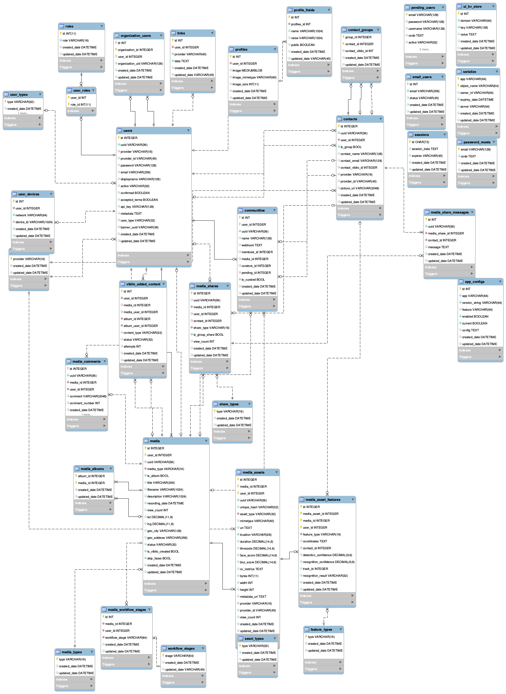

Database Schema
=======================

The schema for the MySQL RDS database.  This is used by both the
website, and the backend.

The schema is maintained with the MySQL Workbench tool, and stored in
schema/ddl/media_id_model.mwb

DDL for populating the schema are present in
schema/ddl/video_*schema.sql

Additional descriptive notes about the organization of the schema is
available in our sharepoint repository at: [https://viblio.sharepoint.com/SitePages/Video%20Schema.aspx]

