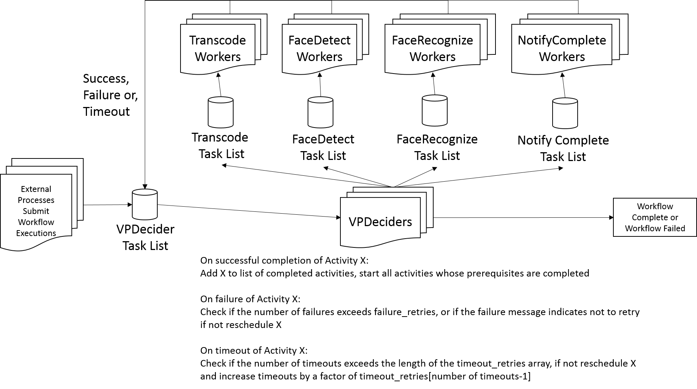

Video Workflow Package
======================

Overview
--------

We use [Amazon Simple Workflow Service
(SWF)](http://aws.amazon.com/swf/) to manage the workflow of our video
pipeline.  We use the [boto.swf](http://boto.readthedocs.org/en/latest/ref/swf.html) ([tutorial](http://boto.readthedocs.org/en/latest/swf_tut.html)) package to manage our interaction with SWF.

Our SWF usage is very regular, with Workflow and Activity types, and
task list names being driven by configuration and our standard local,
staging, and prod deployment concepts.

SWF workflows operate in this manner:
* A workflow is a set of predefined Activities, activities are performed by programs that reiceve an Activity taks, perform them, and provide a result back
* Coordination logic for a workflow (e.g. what activities are performed, in what order, how many times) are performed by a program called a "Decider"

SWF itself provides a reliable message bus and queues between the programs that perform Activities and the Decider program.  

All messages passed between Deciders and Activity workers are passed via "task lists" - which are essentially a named queue.

The essential flow is:

1. A new workflow execution is submitted, which causes a message to be sent to the Decider with the input provided in the submission
2. The Decider determines what, if any, activities should be initiated, and sends messages to those task lists, specifying the input they recieve
3. Activity workers poll their task lists waiting for activities, when a new activity arises they perform their task, and return their output, which is sent via a message back to the Decider
4. The Decider again determines what further activities should be initiated, and steps 2-4 are run until the Decider decides the workflow is complete, or it should be failed

To ensure reliability of a distributed workflow, tasks and decisions have timeouts associated with them.

The workflow itself has a start to close timeout - any workflow not completed within this time will be marked as failed and further messages sent relating to it by Deciders or Activity workers will be ignored.

Decision tasks have a start to close timeout, if a decision is started but not completed in this time period (perhaps the server where the decision was being made crashed) a DecisionTaskTimedOut is added to the workflow history, which has the side effect of triggering a new decision

Acitivies have the following timeouts:
* A schedule to start timeout
* A schedule to close timeout
* A start to close timeout
* An optional heartbeat timeout

A diagram of our workflow:


Video Processing Workflow Configuration
---------------------------------------

Our video processing workflow is configured in
[VPWorkflow.py](./VPWorkflow.py).  VPWorfklow.py primarily defines a
dictionary called VPW whose keys are the names of our pipeline stages,
and whose values specifies for each pipeline stage:

```
    'FaceDetect' : {
        'name'            : 'FaceDetect',
        'domain'          : domain,
        'version'         : version,
        'task_list'       : 'FaceDetectTask',
        'prerequisites'   : [ 'Transcode' ],
        'failure_retries' : 1,
        'timeout_retries' : [1, 2, 4],
        'default_task_schedule_to_close_timeout' : str( 15*60*60 ),
        'default_task_schedule_to_start_timeout' : str( 15*60*60),
        'default_task_start_to_close_timeout' : str( 10*60*60 ),
        'default_task_heartbeat_timeout' : 'NONE',
        },
```

Some details on the above configuration fields:
* task_list is a prefix, the task list will be modified depending on the deployment enviornment we are in
* prerequisites is an array of prerequisite stages defined in VPW, an empty array means there are no prerequisites
* failure_retries - the number of times to retry if a non-timeout failure occurs, note that this does not count the initial attempt: a failure_retry of N means the task may be attempted N+1 times in total
* timeout_retries - the length of this array controls how many times this task will be retried if it failes due to timeout, and a number in the i'th position is the multiple that the default timeouts will be multiplied by on the i'th retry
* The timeouts are specified in seconds, and must be strings due to Amazon's API

Message Format
---------------------------------------

By convention we pass all our messages in JSON format.  Also by
convention, the input to each Activity and the output from each
Activity will be a dictionary with these elements at the top level:

* media_uuid - the uuid of the video we are working on
* user_uuid - the uuid of the user whose video we are working on

Each Activity is responsible for providing enough information in its
output for subsequent stages to perform their work.


VPDecider
---------------------------------------

The [VPDecider](./VPDecider.py) module listens for workflow
execituions and events occuring on existing workflows.  It interprets
the contents of the VPWorkflow data structure and starts stages when
all their prerequisites are met, and completes workflows when all the
tasks in it's run_helper.tasks array are competed, or fails them if a
given task times out too many times or fails too many times (as
determined by configuration in VPWorkflow).

VPDecider also passes along the output of each prerequisite state to
the next activity on input as the value of the key named for the
prerequisite stage.  For example, if the output of ```ActivityABC``` is 
```{ 'abc' : True, 'def' : False }``` then the input to any activity which
lists ActivityABC as a prerequisite will include:

```
{
...
   'ActivityABC' : { 'abc' : True, 'def' : False }
...
```

It listens on the task list called:

```
VPDecider + config.VPWSuffix + config.UniqueTaskList
```

Where VPWSuffix and UniqueTaskList are defined in out
[configuration](../config/README.md).  UniqueTaskList is only used in
local deployments to allow different developers to only see events for
the workflows they are working on, it is not set in staging or prod
deployments.

VPWorkers
----------------------------------------

In our video processing workflow we will have one program for each
Activity invoked by VPDecider.  Each of these will inherit from the
abstract [VPWorker](./VPWorker.py) module which handles several
elements of bookeeping such as:

* Catching exceptions and sending back events that SWF understands on error
* Setting up Loggly logging so the derived classes can instantiate their logs with one line
* Sending instrumentation messages to Mixpanel
* Decoding the input from JSON to a Python dictionary, and encoding the output from a Python dictionary to JSON

Each Activity worker simply inherits from VWorker.py, and overrides
the definition of ```run_task( self, opts )```.  The options provided
will be Python dictionary and will include:

* In the case of an Activity with no prerequisites:

  ```{
    'media_uuid' : ...,
    'user_uuid' : ...,
    # Whatever inputs the caller of the workflow provided
  ```

* In the case of an Activity with prerequisites:

  ```{
    'media_uuid' : ...,
    'user_uuid' : ...,
    'PrerequisiteOneName' : ...output of PrerequisiteOne...,
    'PrerequisiteTwoName' : ...output of PrerequisiteTwo...,
    ...
  ```


----------

* Each thing needs media_uuid and user_uuid
* Exception behavior / retries

Creating a New Stage
--------------------

Each worker class follows a similar pattern of boilerplate similar to
FaceDetect.py to interact with boto/SWF.  All that must be done is:
1) Create a new class derived from VWorker

2) Assign a member variable of that class to the relevant activity
type in VPWorkflow

3) Implement the run_task method.  run_task takes in a Python
dictionary of arguments on input, and returns a Python dictionary of
arguments for the next stage.  run_task can notify the pipeline of an
error by returning a Python dictionary that contains the
ACTIVITY_ERROR key.  If it does this, the truth value of the "retry"
key in the return will specify if this task should be tried again or
if the error is fatal.

It is recommended to create a subdirectory in vib/vwf for each worker
which will have multiple implementation files.

CONFIGURATION
======================================================================
The scripts in this directory require the BOTO_CONFIG environment
variable to point at this directory, and that the vib directory by in
the PYTHONPATH.

Run:

source setup-env.sh

In Bourne/Korn/Bash shells to do this.


